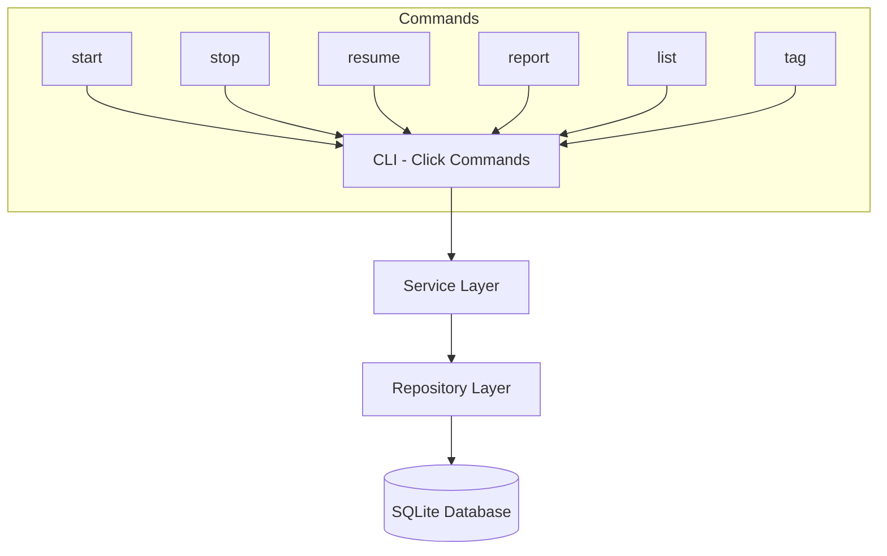
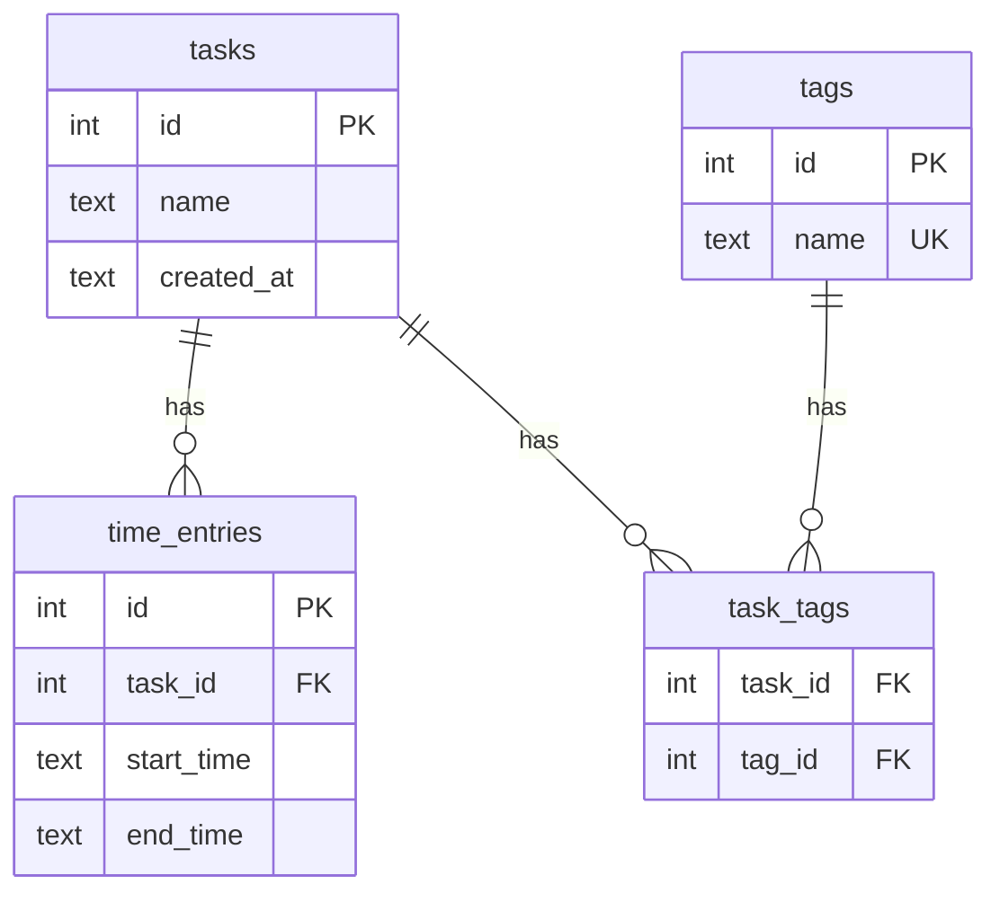

# initial-features - Technical Spec

**Status**: approved
**Owner**: Lucas Zambrano Barboza
**Created**: 2026-05-01
**Last Updated**: 2026-05-01

---

## Executive Summary

A Python CLI application using Click for command parsing and SQLite for local persistence. The app follows a layered architecture: CLI layer (commands) → Service layer (business logic) → Repository layer (data access). All time tracking data is stored in a single SQLite file.

---

## Architecture Overview



**Pattern**: Layered architecture (CLI → Service → Repository)
**Rationale**: Simple, testable, appropriate for a single-user CLI tool. No need for hexagonal/DDD complexity.

---

## Technology Stack

| Component | Technology | Rationale |
|-----------|-----------|-----------|
| Language | Python 3.10+ | User requirement |
| CLI Framework | Click | Mature, well-documented, supports subcommands |
| Database | SQLite3 | User requirement, built-in Python support |
| Testing | pytest | Standard Python testing |
| Table Output | tabulate | Clean terminal table formatting |
| Packaging | pyproject.toml + pip | Standard Python packaging |

---

## Design Decisions

### DD-1: Click over argparse

**Decision**: Use Click for CLI parsing
**Rationale**: Click provides decorators for subcommands, automatic help generation, and cleaner code vs manual argparse setup
**Alternative**: argparse (stdlib) — more boilerplate, less ergonomic

### DD-2: SQLite with raw SQL over ORM

**Decision**: Use sqlite3 stdlib module with raw SQL
**Rationale**: Only 3 tables, no complex queries. An ORM (SQLAlchemy) adds unnecessary dependency and complexity for this scope.
**Alternative**: SQLAlchemy — overkill for 3 simple tables

### DD-3: Single database file location

**Decision**: Default to `~/.tracker/tracker.db`, configurable via `TRACKER_DB_PATH` env var
**Rationale**: Predictable location, easy backup, user-configurable

---

## Data Model

### Database Schema

```sql
CREATE TABLE IF NOT EXISTS tasks (
    id INTEGER PRIMARY KEY AUTOINCREMENT,
    name TEXT NOT NULL,
    created_at TEXT NOT NULL DEFAULT (datetime('now', 'localtime'))
);

CREATE TABLE IF NOT EXISTS tags (
    id INTEGER PRIMARY KEY AUTOINCREMENT,
    name TEXT NOT NULL UNIQUE
);

CREATE TABLE IF NOT EXISTS task_tags (
    task_id INTEGER NOT NULL,
    tag_id INTEGER NOT NULL,
    PRIMARY KEY (task_id, tag_id),
    FOREIGN KEY (task_id) REFERENCES tasks(id),
    FOREIGN KEY (tag_id) REFERENCES tags(id)
);

CREATE TABLE IF NOT EXISTS time_entries (
    id INTEGER PRIMARY KEY AUTOINCREMENT,
    task_id INTEGER NOT NULL,
    start_time TEXT NOT NULL DEFAULT (datetime('now', 'localtime')),
    end_time TEXT,
    FOREIGN KEY (task_id) REFERENCES tasks(id)
);
```

### Entity Relationships



---

## Project Structure

```
ai-improvement/
├── pyproject.toml
├── README.md
├── src/
│   └── tracker/
│       ├── __init__.py
│       ├── cli.py              # Click commands
│       ├── service.py          # Business logic
│       ├── repository.py       # SQLite data access
│       ├── models.py           # Data classes
│       ├── database.py         # DB connection + schema init
│       └── formatting.py       # Report formatting (tabulate)
├── tests/
│   ├── __init__.py
│   ├── test_cli.py
│   ├── test_service.py
│   ├── test_repository.py
│   └── conftest.py             # Fixtures (in-memory SQLite)
```

---

## Fury Platform Compliance

> Not applicable — this is a local Python CLI application, not a Fury-deployed service.

| Requirement | Status | Notes |
|-------------|--------|-------|
| Dockerfile | N/A | Local CLI app, no container deployment |
| Dockerfile.runtime | N/A | No runtime container needed |
| /ping health check endpoint | N/A | No HTTP server |
| Base image (hub.furycloud.io/mercadolibre/distroless-*) | N/A | No container image needed |

---

## REST API Contracts

> Not applicable — this is a CLI application with no HTTP endpoints.
> See "CLI Commands" section below for the user-facing interface.

---

## CLI Commands

| Command | Usage | Description |
|---------|-------|-------------|
| `tracker start` | `tracker start "task name" [--tag TAG]...` | Start task, auto-pause active |
| `tracker stop` | `tracker stop` | Stop/pause active task |
| `tracker resume` | `tracker resume [TASK_ID]` | Resume a paused task |
| `tracker list` | `tracker list` | Show all tasks with status |
| `tracker report` | `tracker report [--from DATE] [--to DATE] [--tag TAG]` | Time report |
| `tracker tag` | `tracker tag TASK_ID --add TAG` | Add tag to existing task |

### Command Details

**`tracker start "task name" --tag dev --tag meeting`**
- Creates task if name doesn't exist, reuses if it does
- Closes active time entry (sets end_time) on any running task
- Opens new time entry for target task
- Associates tags (creates if new)

**`tracker resume [TASK_ID]`**
- Without ID: shows interactive list of paused tasks
- With ID: directly resumes that task
- Same auto-pause behavior as `start`

**`tracker report --from 2026-04-01 --to 2026-04-30 --tag dev`**
- Default: today's tasks
- Outputs table: task name, tags, total time (HH:MM:SS), percentage
- Grand total at bottom

---

## Testing Strategy

**Overall Coverage Target**: 80%+

### Unit Tests

| Layer | Scope | Coverage Target |
|-------|-------|-----------------|
| Service | Business logic (auto-pause, time calc) | 90% |
| Repository | Data access (CRUD, queries) | 80% |
| Formatting | Report output formatting | 70% |

### Integration Tests

| Scope | Coverage |
|-------|----------|
| CLI commands end-to-end via Click test runner | Key flows |
| Full lifecycle: start → pause → resume → report | Critical path |

### E2E Tests

> Not applicable — local CLI application. Integration tests with Click's CliRunner cover full command flows.

**Test Database**: In-memory SQLite (`:memory:`) for fast, isolated tests

**Key Test Scenarios**:
- Start task → verify time entry created
- Start new task → verify previous auto-paused
- Resume task → verify new entry linked to existing task
- Report with filters → verify correct aggregation
- Edge: start same task twice → reuses existing task

---

## Security

- No authentication required (single-user local app)
- Database file permissions: user-only (0600)
- No sensitive data stored
- No network access

---

## Performance

- SQLite indexed on `time_entries.task_id` and `time_entries.start_time`
- All commands target < 100ms response for up to 10,000 entries
- No caching needed — SQLite queries are fast for this scale

---

## Deployment Strategy

- Install via `pip install -e .` for development
- Entry point defined in `pyproject.toml` → `tracker` CLI command
- No Docker/container needed — runs directly on user's machine
- Database auto-initializes on first run (schema migration on startup)
- Distribution: `pip install .` or future PyPI publish
