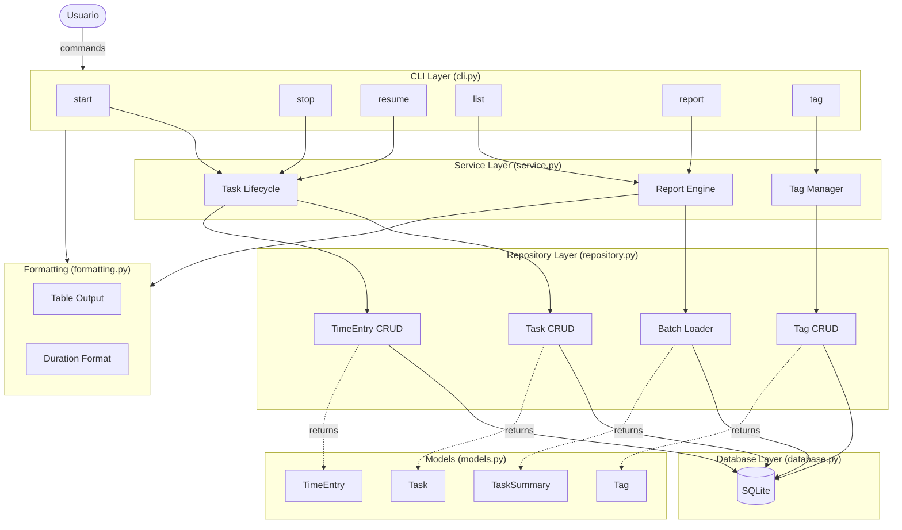

```mermaid
graph TD
    User([Usuario])

    subgraph CLI["CLI Layer (cli.py)"]
        start[start]
        stop[stop]
        resume[resume]
        list[list]
        report[report]
        tag[tag]
    end

    subgraph Service["Service Layer (service.py)"]
        TaskLifecycle[Task Lifecycle]
        ReportEngine[Report Engine]
        TagManager[Tag Manager]
    end

    subgraph Repository["Repository Layer (repository.py)"]
        TaskRepo[Task CRUD]
        EntryRepo[TimeEntry CRUD]
        TagRepo[Tag CRUD]
        BatchLoader[Batch Loader]
    end

    subgraph Models["Models (models.py)"]
        Task[Task]
        TimeEntry[TimeEntry]
        Tag[Tag]
        TaskSummary[TaskSummary]
    end

    subgraph Database["Database Layer (database.py)"]
        SQLite[(SQLite)]
    end

    subgraph Formatting["Formatting (formatting.py)"]
        TableOutput[Table Output]
        DurationFmt[Duration Format]
    end

    User -->|commands| CLI

    start --> TaskLifecycle
    stop --> TaskLifecycle
    resume --> TaskLifecycle
    list --> ReportEngine
    report --> ReportEngine
    tag --> TagManager

    TaskLifecycle --> TaskRepo
    TaskLifecycle --> EntryRepo
    ReportEngine --> BatchLoader
    TagManager --> TagRepo

    TaskRepo --> SQLite
    EntryRepo --> SQLite
    TagRepo --> SQLite
    BatchLoader --> SQLite

    TaskRepo -.->|returns| Task
    EntryRepo -.->|returns| TimeEntry
    TagRepo -.->|returns| Tag
    BatchLoader -.->|returns| TaskSummary

    ReportEngine --> Formatting
    CLI --> Formatting
```
